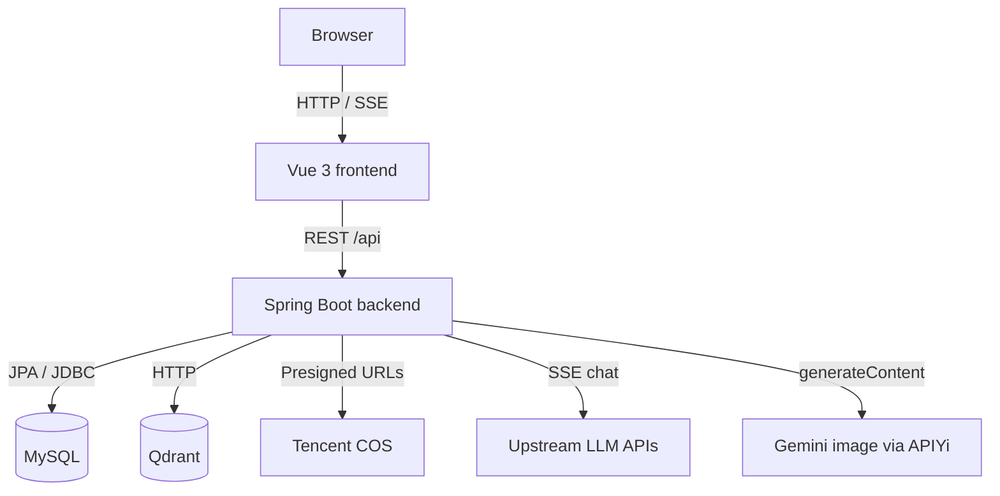

# README maintenance (UIGPT)

## When to run

- User explicitly requests README / docs / architecture overview updates.
- A change alters **public behavior**, **integrations** (LLM, COS, Qdrant, DB), **major routes**, or **documented entry points** listed in [reference-scan-checklist.md](reference-scan-checklist.md).
- Preparing a release or onboarding material.

Do **not** rewrite README for trivial refactors that do not affect architecture, env vars, or user-facing capabilities.

## Maintainer obligation

After substantive edits under the scan scope, either:

1. **Update `README.md` in the same PR/change set**, or  
2. Leave a clear PR comment listing which README sections are stale and must follow this skill in a follow-up.

Prefer (1) when the diff is small.

## Workflow

1. Read [reference-scan-checklist.md](reference-scan-checklist.md) and run the listed reads (do not invent components absent from the repo).
2. Compare findings to the current `README.md`. Patch only sections that are wrong or missing.
3. Preserve existing **Chinese** narrative in `README.md` unless the user asked for an English README; this skill’s language is for **these instructions** and for any **new** technical labels the team chooses to add in English.
4. Never paste secrets. Paraphrase env keys only (e.g. `UIGPT_JWT_SECRET`, `DB_*`).
5. Do not claim Redis or other middleware unless present in `application.yml` / code.

## Required README structure (Markdown)

Use these top-level sections (adapt headings to match the repo’s existing style, e.g. Chinese titles):

### 1. Project overview

- Name, one-line value proposition, up to **three** concrete highlights.
- Scenarios: AI chat, AI image generation, optional RAG admin.

### 2. Architecture (Mermaid)

Use a **high-level** graph. Example shape (adjust node labels to match reality):

### 3. Stack tables

- Frontend: from `frontend/package.json` (Vue, Vite, Pinia, router, axios, scripts).
- Backend: from `backend/pom.xml` (Spring Boot parent version, Java, JPA, WebFlux starter for WebClient, JWT libs, COS, etc.).

### 4. Core modules

For each area, list **responsibility** and **canonical paths** (controllers, services, key Vue views). Update paths if files move—see checklist for current anchors.

### 5. Configuration & operations

- Primary config: `backend/src/main/resources/application.yml`.
- Env templates: `frontend/.env.example`; backend often uses `.env` / `.env.db` (document variable **names**, not values).
- Run, build, migrations, deployment pointers (Docker, nginx SSE) as applicable.

### 6. Changelog (optional)

Short dated bullets for notable doc-affecting releases.

## Quality bar

- Every technical claim must be **verifiable** from the scanned files.
- Prefer tables and short bullets over long prose.
- If the repo gains a new first-class module (e.g. video studio), add a subsection under core modules and extend the Mermaid diagram if it affects data flow.
