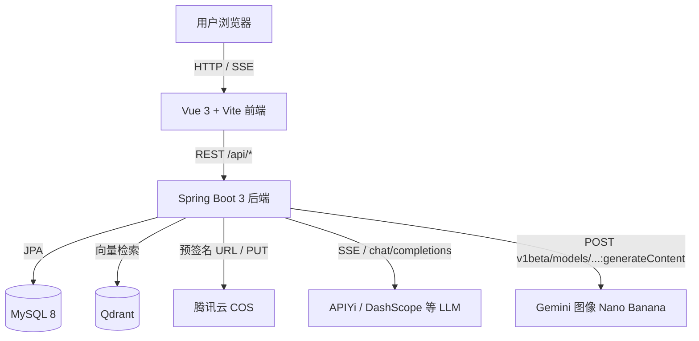
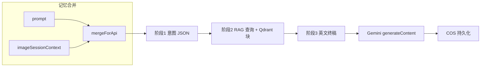

<!-- Generated by Cursor Skill: update-readme -->

# UIGPT

**一句话**：全栈 AI 应用——**多模态对话**（流式 SSE、访客/登录、积分）+ **图片工作台**（Nano Banana / **Gemini `generateContent`** 文生图与编辑）+ **可选 RAG 知识库**（Qdrant + Embedding）+ **腾讯云 COS** 落图。

**亮点**（≤3）

- 对话：`WebClient` 上游 **SSE**，支持多模态与模型池（`chat_models`）。
- 图片：服务端 **三阶段 Prompt 编排**（意图 → RAG 块 → 英文 SD 式组词），最终调用 **APIYi 代理的 `gemini-3-pro-image-preview:generateContent`** 出图。
- 数据：**MySQL 8** 持久化；向量检索 **Qdrant**；对象存储 **COS**；注册/登录限流与 JWT 登出黑名单 **Redis**（默认 `localhost:6379`，见 `spring.data.redis`）。

**适用场景**：企业/团队内部 AI 对话、AI 图像生成、超级管理员维护向量知识库与提示词模板。

---

## 技术架构图（Mermaid）



> 图片生成底层经 **APIYi** 转发至 **Google Gemini 图像模型** 的 **`generateContent`** 端点（配置项 `uigpt.api-yi-image.nano-banana-image-model`，默认 `gemini-3-pro-image-preview`）。

---

## 技术栈总览

### 前端

| 项 | 选型 |
|----|------|
| 框架 | **Vue 3**（Composition API） |
| 状态 | **Pinia** |
| 路由 | **Vue Router 5** |
| 网络 | **Axios**；对话页 **SSE**（`ReadableStream` / `fetch`） |
| UI | **自研样式**（无 Element Plus / Ant Design Vue） |
| 构建 | **Vite 8** |

### 后端

| 项 | 选型 |
|----|------|
| 框架 | **Spring Boot 3.3.x**，**Java 17** |
| Web | **Spring MVC** + **WebClient**（`spring-boot-starter-webflux` 用于客户端，非 WebFlux 容器） |
| ORM | **Spring Data JPA**（非 MyBatis） |
| 数据库 | **MySQL**（`mysql-connector-j`） |
| 安全 | **Spring Security** FilterChain + **`JwtAuthenticationFilter`**（`jjwt` 验签）；`UserDetailsService` 对接 `users`；BCrypt（`spring-security-crypto`）；登出 **Redis** 黑名单 |
| 存储 | **腾讯云 COS**（`cos_api`） |
| 文档解析 | **PDFBox**、**Apache POI**（知识库导入） |

### AI 与外部服务

| 能力 | 说明 |
|------|------|
| 对话 LLM | 默认 **通义千问 OpenAI 兼容**；可切 **OpenAI 兼容** Base URL；模型池见 `chat_models` |
| 图像（工作台） | **APIYi** → **Gemini** `generateContent`（Nano Banana Pro） |
| 图像（高速文生图等） | APIYi：OpenAI `generations` 与 Gemini 加权路由（见 `application.yml`） |
| Embedding | OpenAI 兼容 `/v1/embeddings`（常与 APIYi 同密钥） |
| 向量库 | **Qdrant** HTTP API |

**未使用**：无（注册/登录限流与 JWT 黑名单已用 **Redis**；引入 **Redisson** starter 供后续分布式锁扩展，当前积分路径仍仅用 DB 悲观锁）。

---

## 后端流程详解（多模态对话 · 图片工作台 · 技能）

本节按**真实调用顺序**说明，便于对照 `ChatController` / `ChatService`、`ImageStudioController` / `ImageStudioNanoBananaOrchestrator` 与前端入参。

### A. 对话（Chat）：入口、记忆与多模态

**HTTP 入口**

| 方法 | 路径 | 说明 |
|------|------|------|
| `POST` | `/api/chat` | 非流式整段回复 |
| `POST` | `/api/chat/stream` | **SSE**；首包 `: uigpt-handshake`，正文为 `{"delta":"…"}` JSON 行，结束 `{"done":true,"conversationId":…}` |

**Controller 层（`ChatController`）**

1. 从 `SecurityContextHolder` / `SecurityUtils` 取当前用户名（访客为 `null`）；校验访客不得带 `conversationId`。
2. 若非透传：`ConversationService.injectSessionMemory` 在消息列表**最前**插入一条 `system`（`chat_conversations.session_memory` 摘要；工作台归档会话不注入）。
3. **注意**：主对话接口**不**调用 `RagService.augment`，即标准聊天**不走 Qdrant 向量注入**（与作图侧 RAG 分离）。
4. 流式：先 `PointsService` 扣积分 → `ChatService.prepareStreamChat` → `Executor` 中 `forwardStreamToEmitter` → 成功后 `syncAfterChat` + `refreshSessionMemoryAfterTurn`（透传模式下跳过记忆刷新）。

**`ChatRequest` 与技能相关字段**

| 字段 | 作用 |
|------|------|
| `messages` | 多轮消息；**仅末条 `user` 的 `images[]` 参与视觉**（见 DTO 注释）。 |
| `skillContext` | 前端「技能卡片」等长文本；服务端拼进**额外 system**（`withZhReplySystemPrompt`），**不落库**到用户消息。 |
| `skillId` | 业务分类；当前与识图预检强相关（见下）。 |
| `fastFreeformModel` / `deepReasoning` | 解析为上游 `model` 与降级链（`FastFreeformModelFallback`）。 |
| `useRag` / `ragCollection` | 为透传等扩展预留；**主对话路径不启 Qdrant**。 |

**多模态三条路径（`ChatService`，由 `uigpt.chat.passthrough` 与是否登录共同决定）**

设 `passthrough = appProperties.getChat().isPassthrough()`，`allowVision` = 已登录。

1. **内联多模态（推荐路径，非透传 + 已登录）**  
   - 条件：`!passthrough && useVisionInlineMultimodal(...)`，即**末条 user** 的 `ChatMessageDto.images[]` 经校验后非空。  
   - 校验：`collectVisionImageUrlsFromMessage` 只接受 `data:image/*;base64,...` 或 `https://`；每条消息最多 **4** 张，总 URL 字符数有上限。  
   - 行为：`putMessagesArray` 将该 user 消息序列化为 OpenAI 风格 **`content` 数组**：`{type:text}` + 多个 `{type:image_url, image_url:{url}}`。主模型**直接看图**，不再先调视觉摘要接口。

2. **识图预检 + 文本主对话（非透传 + 已登录 + 末条有图但未走内联时）**  
   - 当未满足内联条件时，对请求副本执行 `withVisionPreflight`。  
   - **仅当 `skillId` 为 `freeform`**（常量 `VISION_PREFLIGHT_SKILL_IDS`）且 `ApiYiImageService` 视觉就绪时：用末条用户图 URL 调 **`visionChatAnalyze`**，生成简体中文摘要，**追加到 `skillContext`**（前缀 `【参考图·API易视觉模型摘要】`），**不改库内消息正文**。主请求仍为纯文本多轮 + 增强后的 system 块。

3. **透传模式**  
   - `messages` 原样上传（不注入「中文回复」system，除非客户端自己传）。  
   - `embedVision` 由 `messageThreadHasVisionImages` 决定：线程中**任一条** user 含合法图 URL 则对该条用 `content[]` 多模态序列化；纯图无字时可用空格占位（`passthroughPlainMessages`）。

**访客**：`allowVision=false`，不内联多模态、不走识图预检追加。

**会话记忆**：非透传且带 `conversationId` 时注入 `session_memory`；每轮结束后 `mergeSessionMemorySummary` 异步合并进库（工作台归档会话跳过）。

---

### B. 图片工作台（Image Studio）：Nano Banana 全链路

**HTTP 前缀**：`/api/image-studio`（`ImageStudioController`），均需登录；出图前校验 COS 可用。

**请求体共性（文生图 `ImageStudioTextRequest` / 编辑 `ImageStudioEditRequest`）**

| 字段 | 含义 |
|------|------|
| `prompt` | 用户指令（经编排后仍可能再被模型消费）。 |
| `userDisplayPrompt` | 可选；**落库展示**优先用该字段。 |
| `imageSessionContext` | 前端维护的多轮摘要（最长约 12k）；服务端与 `prompt` 合并。 |
| `aspectRatio` / `imageSize` | 画幅与分辨率档位（影响积分档位 `ImageGenerationPointCosts`）。 |
| `ragCollection` | 可选；覆盖默认 Qdrant 集合名（合法字符限制见 DTO）。 |
| `imageStudioSessionId` | 非空则写入 **图片会话**表；否则可走 **对话归档**会话存图（`ConversationImageService.persistImageStudioGeneration`）。 |
| `studioToolId` | 工作台工具：`txt2img` / `img2img` / `inpaint` / `outpaint` / `enhance` / `style`，供作品库按类型归档。 |
| `studioSkillId` | 作图**技能策略**（与前端技能 id 对齐，见下文 C 节）。 |
| `useRag` | 历史兼容字段；**三阶段内是否注入向量块**由 `studioSkillId`（`ImageStudioSkillIds.ragKnowledgeBlockEnabled`）与全局 `uigpt.rag` 决定，而非该布尔值单独关闭 Planner。 |

**编辑专用**：`ImageStudioEditRequest.images[]`：`mimeType` + `dataBase64`（可带 `data:...;base64,` 前缀）；单张解码后 **≤ 8MB**。

**编排总线：`ImageStudioNanoBananaOrchestrator`**

1. **`ImageMemoryService.mergeForApi(userPrompt, imageSessionContext)`**（默认实现 `DefaultImageMemoryService`）  
   - 若有会话上下文：拼成 `【当前图片会话上下文】` + 分隔 + `【本次指令】` + 用户句；上下文超长约 **8000** 字符截断。

2. **`NanoBananaPromptPlanner.plan`** —— 固定 **三阶段**（最终得到 `FinalImagePrompt.promptForApi()`）  
   - **阶段 1 · 意图 JSON**：`IntentRouter` → `ApiYiImageService.imageStudioPhase1IntentJson`（上游 chat/completions）。`ImageStudioSkillPrompts.phase1IntentSystem(studioSkillId)` 选择系统提示：**家装**用 `ImageStudioIntentPrompts`，**全能大师**用 `UniversalImageStudioIntentPrompts`。产出结构化 JSON（含后续 RAG 用的字段等）。  
   - **阶段 2 · RAG 查询句**：`NanoBananaRagQueryExtractor.resolveRagEmbeddingQuery` 从意图 JSON 取 `rag_embedding_query`，否则从 `style_en_hints` 等兜底；家装技能会在兜底句后附加 `interior design` 等后缀。  
   - **阶段 2b · 向量块**：`RagService.retrieveKnowledgeBlockForImage(query, useRagFlag, collectionOverride)`。当 `ImageStudioSkillIds.ragKnowledgeBlockEnabled(studioSkillId)` 为 **false**（当前即 **`universal_master`**）时，**不检索、不注入知识块**（等价 `useRag=false` 传入检索层）。否则按全局 RAG 配置 + 集合名做 embedding → Qdrant → 拼接带固定头的文本块。  
   - **阶段 3 · 最终英文 Prompt**：`PromptStrategyGenerator.finalPromptForNanoBanana`；`ImageStudioSkillPrompts.phase3SystemCombined(studioSkillId)` 选择第三阶段系统提示与附录：**家装**走 `InteriorNanoBananaPromptOptimizer` + 家装附录；**全能大师**走 `UniversalNanoBananaPromptOptimizer` + 通用附录。

3. **`ImageToolExecutor`**：`nanoBananaTextToImage` / `nanoBananaEditImages` → `ApiYiImageService` 组装 Gemini **`generateContent`**（文：单 text part + 生成配置；图编：text + 多段 `inlineData`）。

4. **落库与响应**：PNG 字节上传 COS；返回 `mimeType`、`imageBase64`、浏览器可读 `imageUrl`、`imageId` 等（见 `ImageStudioGenerateResponse` / `ImageStudioPairResponse`）。

**多候选接口**（`*-pair`）

- 因 Gemini 无 OpenAI 式 `n` 参数，服务端用 **线程池并行**多路相同（或略多样化）prompt，候选数由 `candidateCount` 与 `uigpt.image-studio.pair-max-candidates` 限制。  
- 积分按**一次用户动作**扣一单档（非按张数倍增）。  
- 可选 `ImageCandidateJudge` 打分得到 `recommendedSlot`（配置关闭时为空）。

**提示词优化接口**：`POST /api/image-studio/prompt/optimize` —— 先用 `RagService.augmentPromptForImage` 做**扩写用**向量前缀（与三阶段内 `retrieveKnowledgeBlockForImage` 不同用途），再调 `ApiYiImageService.optimizeImageStudioPrompt`。



---

### C. 技能选择：对话侧 vs 图片侧（前后端对齐）

**1）对话页（`ChatView` 等）**

- **`skillContext`**：任意技能卡片文案 → 仅影响**本轮** system 拼接。  
- **`skillId`**：后端硬编码 **`freeform`** 才触发 **识图预检**（`visionChatAnalyze`）；其它取值不改变预检逻辑。  
- 与图片工作台的 `studioSkillId`**不是同一枚举**。

**2）图片工作台（`ImageGenView` + `skillStore.js`）**

- 下拉 / 技能广场维护的 **`studioSkillId`** 写入请求体，并可通过 **`PATCH` 图片会话**、URL query `studioSkill`、以及 `sessionStorage`（`STUDIO_SKILL_STORAGE_KEY`）持久化用户偏好。  
- **前端**：`skillStore.normalizeStudioSkillId` 对「未知 id」回落为 store 内默认技能（种子数据优先 `universal_master`）。  
- **后端**：`ImageStudioSkillIds.normalize` **仅识别** `interior_designer` 与 `universal_master`；**任何其它字符串（含用户在广场自建的 id）一律按 `interior_designer` 策略走家装三阶段 Prompt**。若要让自建 id 生效，需同步扩展后端 `ImageStudioSkillIds` 与 `ImageStudioSkillPrompts` 分支。  
- **`universal_master`**：`ragKnowledgeBlockEnabled == false`，不注入 Qdrant 知识块，阶段 1/3 使用「通用」提示词资源。  
- **`interior_designer`**：绑定家装意图与 RAG 查询风格；`ragCollection` 在前端种子中与 **`home_design`** 集合对应（仍以服务端 `application.yml` 默认集合为准，override 可改）。

**3）RAG 集合与 `ragCollection`**

- 作图检索集合由全局 `uigpt.rag` 与请求体 `ragCollection` 共同解析（非法则回退默认）。  
- 技能广场中为用户技能配置的 `ragCollection` 会随 `studioSkillId` 由前端传入作图请求；后端未知 `studioSkillId` 时仍走家装逻辑，但 **override 集合名仍可能生效**（因走同一 `ImageStudioTextRequest.getRagCollection()`）。

---

## 核心功能模块

### 1. AI 对话（Chat）

- **职责**：流式对话、多模态参考图、访客模式、登录用户积分扣减、会话与消息持久化。
- **流程摘要**：见上文 **「后端流程详解」→ A. 对话**（SSE 形状、`skillContext` / `skillId`、内联多模态与识图预检分支）。
- **关键文件**：`backend/.../controller/ChatController.java`、`ConversationController.java`、`service/ChatService.java`、`service/ConversationService.java`、`service/JwtService.java`；前端 `frontend/src/views/ChatView.vue`。
- **要点**：
  - SSE：`ResponseBodyEmitter` + 上游 `WebClient` 流式读取。
  - 配置 `uigpt.chat.passthrough` 控制是否跳过改写与记忆注入。
  - 积分：`PointsService` + `uigpt.points.*`。
- **数据流**：浏览器 SSE → `ChatController` → `ChatService` → 上游 LLM → 增量写回客户端；登录用户消息落 `chat_messages`。

### 2. AI 图像工作台（Image Studio）

- **职责**：文生图 / 图生图 / 局部重绘 / 智能扩图 / 画质增强 / 风格迁移（前端工具态）；服务端 **Nano Banana** 管线。
- **流程摘要**：见上文 **「后端流程详解」→ B. 图片工作台**（三阶段 Planner、`*-pair` 多候选、`studioToolId` / `studioSkillId`）。
- **关键文件**：`ImageStudioController.java`、`ImageStudioSessionController.java`、`imagestudio/orchestration/ImageStudioNanoBananaOrchestrator.java`、`NanoBananaPromptPlanner.java`、`service/ApiYiImageService.java`；前端 `ImageGenView.vue`。
- **要点**：
  - **Planner**：`NanoBananaPromptPlanner`（意图 JSON → RAG 块 → 最终英文 prompt）。
  - **出图**：`ApiYiImageService.nanoBananaTextToImage` / `nanoBananaEditImages` → **`...:generateContent`**。
  - **技能**：`studioSkillId`（如 `interior_designer` / `universal_master`）；全能大师关闭 RAG 知识块注入（见 `ImageStudioSkillIds`）。
  - **会话**：`image_studio_sessions` / `image_studio_session_images`（DDL 已并入 `docs/schema-mysql.sql`；`backend/src/main/resources/db/README.md` 为说明）。
- **数据流**：前端 `POST /api/image-studio/nano-banana/*` → Orchestrator 组 prompt → `generateContent` → 二进制图 → **COS** → 返回 URL / 会话归档。

### 3. RAG 知识库

- **职责**：超级管理员维护文档、向量化入库；**作图**与「提示词优化」等接口使用向量检索；标准 **`/api/chat` / `/api/chat/stream` 不在此路径注入 Qdrant**（见 `ChatController` 注释与上文 A 节）。
- **关键文件**：`RagAdminController.java`、`RagService.java`、`KnowledgeBaseView.vue`（前端）。
- **要点**：MySQL `knowledge_documents` 元数据 + **Qdrant** 向量；`uigpt.rag.*` 开关与超时；作图三阶段内检索 `retrieveKnowledgeBlockForImage`；扩写优化用 `augmentPromptForImage`。
- **数据流**：上传 → 解析分块 → embedding → upsert Qdrant → 写 MySQL；读列表走 MySQL，检索走 Qdrant。

### 4. 用户、鉴权与积分

- **职责**：注册/登录/JWT、个人资料、积分扣减与退还；Spring Security 鉴权与登出黑名单。
- **关键文件**：`SecurityConfig.java`、`JwtAuthenticationFilter.java`、`DbUserDetailsService.java`、`AuthController.java`、`MeController.java`、`JwtService.java`、`PointsService.java`；前端 `stores/auth.js`、`api/auth.js`、`LoginView.vue`。
- **要点**：BCrypt 密码；JWT Header `Authorization: Bearer`；`POST /api/logout` 将令牌写入 Redis 黑名单后前端再清本地存储；注册页**两整数加法**图片验证码（填数字结果）与可选 reCAPTCHA v3。
- **数据流**：登录颁发 JWT → 前端存储 → 请求经 Filter 写入 `SecurityContext`；扣费在业务方法内 assert/deduct。

### 5. 提示词与技能广场（前端）

- **职责**：提示词模板 CRUD（超管）；技能卡片管理（Pinia + `localStorage`），与图片工作台技能下拉联动。
- **前后端对齐**：见上文 **「后端流程详解」→ C. 技能选择**（`studioSkillId` 后端仅两档策略、自建 id 回落规则）。
- **关键文件**：`PromptTemplateController.java` / `AdminPromptTemplateController.java`；前端 `PromptsView.vue`、`SkillPlaza.vue`、`stores/skillStore.js`。
- **要点**：技能元数据当前**前端持久化**；后端 Prompt 策略以 `ImageStudioSkillIds` 为准，扩展技能需改后端。

### 6. 其它页面

| 模块 | 路由 | 说明 |
|------|------|------|
| 视频工作台 | `/video-gen` | `VideoStudioController` + `VideoGenView.vue` |
| 历史 / 作品 | `/history`、`/works` | 会话与作品列表 |
| 作品库（图片台） | `/studio-works` | 图片会话相关作品 |
| 站内信 / 用户管理 | `/admin/*` | 管理员 |

---

## 数据库设计概览

**一键建库**：`docs/schema-mysql.sql`（含 `users`、`chat_*`、`chat_models`、`prompt_templates`、`knowledge_documents`、`image_studio_sessions` / `image_studio_session_images`、`site_mail_*` 等；**新环境只执行此文件即可**）。

**已有老库缺列**：`docs/migrate-incremental-columns.sql`（可重复执行）。拆分 DDL 已废弃，说明见 `backend/src/main/resources/db/README.md`。

**文字版 ER 关系**：

- `users` 1 — N `chat_conversations`；`chat_conversations` 1 — N `chat_messages`。
- `chat_conversation_images` 关联会话与用户，存 COS `object_key` / `image_url`。
- `image_studio_sessions` 1 — N `image_studio_session_images`（工作台出图记录）。
- `knowledge_documents` 与 Qdrant 点 id / collection 逻辑关联（详见服务实现）。

---

## 项目目录结构

```text
uigpt/
├── README.md                 # 本文件
├── docs/
│   ├── schema-mysql.sql      # MySQL 一键建库（全业务表）
│   └── setup.md              # 环境补充说明
├── frontend/                 # Vue 3 + Vite
│   ├── src/
│   │   ├── views/            # ChatView, ImageGenView, VideoGenView, KnowledgeBaseView, SkillPlaza, PromptsView…
│   │   ├── components/       # 业务组件（chat、image-studio、skill-plaza…）
│   │   ├── api/              # HTTP 封装
│   │   ├── stores/           # Pinia（auth、skill、knowledgeImport…）
│   │   ├── router/index.js   # 路由与权限 meta
│   │   └── layouts/ModuleLayout.vue
│   ├── vite.config.js        # 代理 /api → 8088；版本号读 backend/.env 等
│   └── package.json
├── backend/                  # Spring Boot
│   ├── src/main/java/top/uigpt/
│   │   ├── controller/       # REST 入口
│   │   ├── service/          # 业务与 RAG、COS、对话编排
│   │   ├── imagestudio/      # Nano Banana 编排与技能 ID
│   │   ├── entity/repository/
│   │   └── config/
│   ├── src/main/resources/
│   │   ├── application.yml   # 主配置（占位符引用环境变量）
│   │   └── db/               # DDL 说明（README）；建表执行 docs/schema-mysql.sql
│   └── pom.xml
├── docker/                   # 镜像构建与 TCR 推送说明
└── skills/                   # 可选 Cursor Skill（如 frontend-design-3）
```

---

## 快速开始

### 环境要求

- **Java 17+**
- **Node.js**（建议 20.19+ 或 22.12+，与 Vite 要求一致）
- **MySQL 8+**
- **Redis**（注册/登录限流、JWT 黑名单；默认 `localhost:6379`，可用 `REDIS_HOST` / `REDIS_PORT`；仅当 Redis 启用密码时使用 `SPRING_DATA_REDIS_PASSWORD` 或 `spring.data.redis.password`，无密码时不要设空密码以免触发 AUTH）
- 可选：**Qdrant**、**腾讯云 COS**、**APIYi / DashScope** 等密钥（见下）

### 数据库

1. 在 MySQL 中执行 **`docs/schema-mysql.sql`**（一次创建全部业务表，含知识库与图片工作台会话、站内信等）。
2. 若为**多年前初始化的旧库**缺列，再执行 **`docs/migrate-incremental-columns.sql`**（可重复执行）。

### 后端

```bash
cd backend
# 配置环境变量：至少 UIGPT_JWT_SECRET、DB_*、Redis（默认本机 6379 可不配）、AI 密钥等，见下文「环境变量」
mvn spring-boot:run
```

默认端口 **8088**（`application.yml`）。

### 前端

```bash
cd frontend
npm install
npm run dev
```

默认 **5173**，`/api` 由 Vite 代理到 `http://localhost:8088`。

### 前端版本号（个人中心）

在 **`backend/.env`** 中配置（推荐）：

```env
VITE_APP_VERSION=v4.0.4
# 或
version=v4.0.4
```

构建时由 `frontend/vite.config.js` 注入 `__APP_VERSION__`；`npm run predev` / `prebuild` 会同步 `package.json` 的 `version`（见 `frontend/scripts/sync-version-from-env.mjs`）。

---

## 环境变量（摘要）

**切勿将真实密钥、密码提交到 Git。** 生产用环境变量或密钥管理服务注入。

| 类别 | 代表变量 |
|------|-----------|
| 数据库 | `DB_HOST`、`DB_PORT`、`DB_NAME`、`DB_USERNAME`、`DB_PASSWORD` 或 `DB_URL` |
| JWT | `UIGPT_JWT_SECRET`（UTF-8 至少 32 字节） |
| 对话 LLM | 登录用户全局回退：`DASHSCOPE_API_KEY` / `QWEN_API_KEY` / `QIANWEN_API_KEY` / `OPENAI_API_KEY`，`AI_BASE_URL`、`AI_MODEL`；**访客**（未登录）在配置 `QIANWEN_API_KEY` 时走 `uigpt.guest-chat`（默认通义千问兼容地址与 `QIANWEN_MODEL`，可选 `QIANWEN_BASE_URL`） |
| APIYi 图像 / Nano Banana | `APIYI_API_KEY`、`APIYI_BASE_URL` 等（见 `application.yml` → `uigpt.api-yi-image`） |
| RAG | `UIGPT_RAG_ENABLED`、`UIGPT_RAG_QDRANT_URL`、`UIGPT_RAG_COLLECTION`、`UIGPT_RAG_EMBEDDING_*` |
| COS | `COS_SECRET_ID`、`COS_SECRET_KEY`、`COS_REGION`、`COS_BUCKET` |
| 管理员 | `UIGPT_ADMIN_USERNAMES`（逗号分隔用户名） |

更完整的表与说明见历史文档 **`docs/setup.md`** 及 **`backend/src/main/resources/application.yml` 内联注释**。

---

## 部署指南（摘要）

1. **前端**：`cd frontend && npm run build`，将 `dist/` 置于 Nginx（或 CDN）静态资源。
2. **后端**：`mvn -Pprod package`（按项目实际 Profile），JAR 部署；环境变量与生产库一致。
3. **反向代理**：`/api` 转发至 Spring Boot；**SSE** 路径（如 `/api/chat/stream`）需关闭缓冲，示例：

```nginx
location /api/ {
    proxy_pass http://127.0.0.1:8088;
    proxy_http_version 1.1;
    proxy_set_header Host $host;
    proxy_set_header X-Forwarded-For $proxy_add_x_forwarded_for;
    proxy_buffering off;
    proxy_read_timeout 600s;
}
```

4. **CORS**：生产按域名收紧（见 `WebConfig`）。
5. **容器**：参考 `docker/README.md`（腾讯云 TCR 构建与推送）。

---

## 开发规范与贡献指南

- **分支**：功能 `feat/…`、修复 `fix/…`；主分支保护按团队规范。
- **提交**：建议 Conventional Commits（`feat:`、`fix:`、`docs:` 等）。
- **PR**：描述动机、影响范围、关联 Issue；涉及库表变更请附带 SQL 迁移说明。
- **代码风格**：前端以 ESLint/Prettier 为准（若已配置）；后端 Java 常规格式化 + Lombok。
- **README**：若改动影响架构、技术栈、模块入口、配置或部署方式，请在同一变更中同步更新本文件；维护步骤见 Cursor 项目技能 **`readme-maintenance`**（`.cursor/skills/readme-maintenance/`，配套规则 `.cursor/rules/readme-maintenance.mdc`）。

---

## 更新日志（Changelog）

### v1.1.0

- README 按当前仓库结构重写：补充 Image Studio、Gemini `generateContent`、技能广场、版本号与 `backend/.env` 说明。
- 保留原「环境变量 / 知识库 / 启动」要点并归档至对应章节。
- **补充**：后端流程详解（对话多模态分支、图片三阶段与 COS 落库、对话技能 vs `studioSkillId` 及前后端一致性说明）；修正「主对话不经 Qdrant 注入」表述。
- **数据库**：`docs/schema-mysql.sql` 合并原 `backend/src/main/resources/db/*.mysql.sql` 拆脚，一键建全表；`db/` 下保留 `README.md` 说明。

### v1.0.0

- 系统初始化：Vue 3 + Spring Boot 3 全栈、对话 SSE、图片工作台、RAG、COS、积分与注册体系。

---

## 常见错误（摘录）

- **无法启动 / IllegalStateException**：`UIGPT_JWT_SECRET` 未设或过短。
- **Could not resolve placeholder**：必填 `DB_*` 或数据源相关未配置。
- **对话 503**：未配置任一对话 API Key。
- **图片工作台列不存在 / 表不存在**：新库请重新执行完整 **`docs/schema-mysql.sql`**；旧库执行 **`docs/migrate-incremental-columns.sql`** 或按实体手工 `ALTER`。
- **前端 401**：JWT 过期或无效。

---

## 禁止事项（文档约束）

- 不编造仓库中不存在的中间件（如 **无 Redis**）。
- 不粘贴真实 **API Key、数据库密码、JWT Secret**。
- 图片生成须明确 **Gemini `generateContent`** 链路（经 APIYi）。
