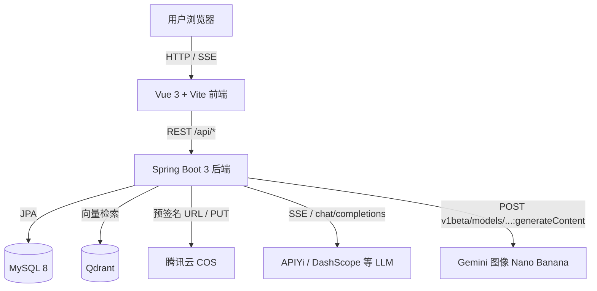

<!-- Generated by Cursor Skill: update-readme -->

# UIGPT

**一句话**：全栈 AI 应用——**多模态对话**（流式 SSE、访客/登录、积分）+ **图片工作台**（Nano Banana / **Gemini `generateContent`** 文生图与编辑）+ **可选 RAG 知识库**（Qdrant + Embedding）+ **腾讯云 COS** 落图。

**亮点**（≤3）

- 对话：`WebClient` 上游 **SSE**，支持多模态与模型池（`chat_models`）。
- 图片：服务端 **三阶段 Prompt 编排**（意图 → RAG 块 → 英文 SD 式组词），最终调用 **APIYi 代理的 `gemini-3-pro-image-preview:generateContent`** 出图。
- 数据：**MySQL 8** 持久化；向量检索 **Qdrant**；对象存储 **COS**（无 Redis 依赖）。

**适用场景**：企业/团队内部 AI 对话、AI 图像生成、超级管理员维护向量知识库与提示词模板。

---

## 技术架构图（Mermaid）



> 图片生成底层经 **APIYi** 转发至 **Google Gemini 图像模型** 的 **`generateContent`** 端点（配置项 `uigpt.api-yi-image.nano-banana-image-model`，默认 `gemini-3-pro-image-preview`）。

---

## 技术栈总览

### 前端

| 项 | 选型 |
|----|------|
| 框架 | **Vue 3**（Composition API） |
| 状态 | **Pinia** |
| 路由 | **Vue Router 5** |
| 网络 | **Axios**；对话页 **SSE**（`ReadableStream` / `fetch`） |
| UI | **自研样式**（无 Element Plus / Ant Design Vue） |
| 构建 | **Vite 8** |

### 后端

| 项 | 选型 |
|----|------|
| 框架 | **Spring Boot 3.3.x**，**Java 17** |
| Web | **Spring MVC** + **WebClient**（`spring-boot-starter-webflux` 用于客户端，非 WebFlux 容器） |
| ORM | **Spring Data JPA**（非 MyBatis） |
| 数据库 | **MySQL**（`mysql-connector-j`） |
| 安全 | **自研 JWT**（`jjwt` + `spring-security-crypto`），无 Spring Security FilterChain 全栈鉴权 |
| 存储 | **腾讯云 COS**（`cos_api`） |
| 文档解析 | **PDFBox**、**Apache POI**（知识库导入） |

### AI 与外部服务

| 能力 | 说明 |
|------|------|
| 对话 LLM | 默认 **通义千问 OpenAI 兼容**；可切 **OpenAI 兼容** Base URL；模型池见 `chat_models` |
| 图像（工作台） | **APIYi** → **Gemini** `generateContent`（Nano Banana Pro） |
| 图像（高速文生图等） | APIYi：OpenAI `generations` 与 Gemini 加权路由（见 `application.yml`） |
| Embedding | OpenAI 兼容 `/v1/embeddings`（常与 APIYi 同密钥） |
| 向量库 | **Qdrant** HTTP API |

**未使用**：Redis（注册限流等为进程内内存，多实例需网关或外存）。

---

## 核心功能模块

### 1. AI 对话（Chat）

- **职责**：流式对话、多模态参考图、访客模式、登录用户积分扣减、会话与消息持久化。
- **关键文件**：`backend/.../controller/ChatController.java`、`ConversationController.java`、`service/ChatService.java`、`service/ConversationService.java`、`service/JwtService.java`；前端 `frontend/src/views/ChatView.vue`。
- **要点**：
  - SSE：`ResponseBodyEmitter` + 上游 `WebClient` 流式读取。
  - 配置 `uigpt.chat.passthrough` 控制是否跳过改写与记忆注入。
  - 积分：`PointsService` + `uigpt.points.*`。
- **数据流**：浏览器 SSE → `ChatController` → `ChatService` → 上游 LLM → 增量写回客户端；登录用户消息落 `chat_messages`。

### 2. AI 图像工作台（Image Studio）

- **职责**：文生图 / 图生图 / 局部重绘 / 智能扩图 / 画质增强 / 风格迁移（前端工具态）；服务端 **Nano Banana** 管线。
- **关键文件**：`ImageStudioController.java`、`ImageStudioSessionController.java`、`imagestudio/orchestration/ImageStudioNanoBananaOrchestrator.java`、`NanoBananaPromptPlanner.java`、`service/ApiYiImageService.java`；前端 `ImageGenView.vue`。
- **要点**：
  - **Planner**：`NanoBananaPromptPlanner`（意图 JSON → RAG 块 → 最终英文 prompt）。
  - **出图**：`ApiYiImageService.nanoBananaTextToImage` / `nanoBananaEditImages` → **`...:generateContent`**。
  - **技能**：`studioSkillId`（如 `interior_designer` / `universal_master`）；全能大师关闭 RAG 知识块注入（见 `ImageStudioSkillIds`）。
  - **会话**：`image_studio_sessions` / `image_studio_session_images`（SQL 见 `backend/src/main/resources/db/`）。
- **数据流**：前端 `POST /api/image-studio/nano-banana/*` → Orchestrator 组 prompt → `generateContent` → 二进制图 → **COS** → 返回 URL / 会话归档。

### 3. RAG 知识库

- **职责**：超级管理员维护文档、向量化入库、对话/作图侧检索注入。
- **关键文件**：`RagAdminController.java`、`RagService.java`、`KnowledgeBaseView.vue`（前端）。
- **要点**：MySQL `knowledge_documents` 元数据 + **Qdrant** 向量；`uigpt.rag.*` 开关与超时；作图检索 `retrieveKnowledgeBlockForImage`。
- **数据流**：上传 → 解析分块 → embedding → upsert Qdrant → 写 MySQL；读列表走 MySQL，检索走 Qdrant。

### 4. 用户、鉴权与积分

- **职责**：注册/登录/JWT、个人资料、积分扣减与退还。
- **关键文件**：`AuthController.java`、`MeController.java`、`JwtService.java`、`PointsService.java`；前端 `stores/auth.js`、`LoginView.vue`。
- **要点**：BCrypt 密码；JWT Header `Authorization: Bearer`；注册图形验证码与可选 reCAPTCHA v3。
- **数据流**：登录颁发 JWT → 前端存储 → 后续 API 带 Bearer；扣费在业务方法内 assert/deduct。

### 5. 提示词与技能广场（前端）

- **职责**：提示词模板 CRUD（超管）；技能卡片管理（Pinia + `localStorage`），与图片工作台技能下拉联动。
- **关键文件**：`PromptTemplateController.java` / `AdminPromptTemplateController.java`；前端 `PromptsView.vue`、`SkillPlaza.vue`、`stores/skillStore.js`。
- **要点**：技能数据当前**前端持久化**；后端仍按 `studioSkillId` 字符串路由 Prompt 策略。

### 6. 其它页面

| 模块 | 路由 | 说明 |
|------|------|------|
| 视频工作台 | `/video-gen` | `VideoStudioController` + `VideoGenView.vue` |
| 历史 / 作品 | `/history`、`/works` | 会话与作品列表 |
| 作品库（图片台） | `/studio-works` | 图片会话相关作品 |
| 站内信 / 用户管理 | `/admin/*` | 管理员 |

---

## 数据库设计概览

**基线脚本**：`docs/schema-mysql.sql`（`users`、`chat_conversations`、`chat_messages`、`chat_conversation_images`、`chat_models`、`prompt_templates` 等）。

**增量/扩展**（按需执行，路径在 `backend/src/main/resources/db/`）：

- `knowledge_documents.mysql.sql` — 知识库文档表。
- `image_studio_sessions.mysql.sql` / `image_studio_sessions_add_studio_skill_id*.sql` — 图片工作台会话与 `studio_skill_id` 列。

**文字版 ER 关系**：

- `users` 1 — N `chat_conversations`；`chat_conversations` 1 — N `chat_messages`。
- `chat_conversation_images` 关联会话与用户，存 COS `object_key` / `image_url`。
- `image_studio_sessions` 1 — N `image_studio_session_images`（工作台出图记录）。
- `knowledge_documents` 与 Qdrant 点 id / collection 逻辑关联（详见服务实现）。

---

## 项目目录结构

```text
uigpt/
├── README.md                 # 本文件
├── docs/
│   ├── schema-mysql.sql      # MySQL 基线建表
│   └── setup.md              # 环境补充说明
├── frontend/                 # Vue 3 + Vite
│   ├── src/
│   │   ├── views/            # ChatView, ImageGenView, VideoGenView, KnowledgeBaseView, SkillPlaza, PromptsView…
│   │   ├── components/       # 业务组件（chat、image-studio、skill-plaza…）
│   │   ├── api/              # HTTP 封装
│   │   ├── stores/           # Pinia（auth、skill、knowledgeImport…）
│   │   ├── router/index.js   # 路由与权限 meta
│   │   └── layouts/ModuleLayout.vue
│   ├── vite.config.js        # 代理 /api → 8088；版本号读 backend/.env 等
│   └── package.json
├── backend/                  # Spring Boot
│   ├── src/main/java/top/uigpt/
│   │   ├── controller/       # REST 入口
│   │   ├── service/          # 业务与 RAG、COS、对话编排
│   │   ├── imagestudio/      # Nano Banana 编排与技能 ID
│   │   ├── entity/repository/
│   │   └── config/
│   ├── src/main/resources/
│   │   ├── application.yml   # 主配置（占位符引用环境变量）
│   │   └── db/               # 增量 SQL
│   └── pom.xml
├── docker/                   # 镜像构建与 TCR 推送说明
└── skills/                   # 可选 Cursor Skill（如 frontend-design-3）
```

---

## 快速开始

### 环境要求

- **Java 17+**
- **Node.js**（建议 20.19+ 或 22.12+，与 Vite 要求一致）
- **MySQL 8+**
- 可选：**Qdrant**、**腾讯云 COS**、**APIYi / DashScope** 等密钥（见下）

### 数据库

1. 执行 `docs/schema-mysql.sql`。
2. 若用知识库：执行 `backend/src/main/resources/db/knowledge_documents.mysql.sql`。
3. 若用图片工作台会话：执行 `backend/src/main/resources/db/image_studio_sessions.mysql.sql`，已有库可执行 `image_studio_sessions_add_studio_skill_id*.sql` 补列。

### 后端

```bash
cd backend
# 配置环境变量：至少 UIGPT_JWT_SECRET、DB_*、AI 密钥等，见下文「环境变量」
mvn spring-boot:run
```

默认端口 **8088**（`application.yml`）。

### 前端

```bash
cd frontend
npm install
npm run dev
```

默认 **5173**，`/api` 由 Vite 代理到 `http://localhost:8088`。

### 前端版本号（个人中心）

在 **`backend/.env`** 中配置（推荐）：

```env
VITE_APP_VERSION=v4.0.4
# 或
version=v4.0.4
```

构建时由 `frontend/vite.config.js` 注入 `__APP_VERSION__`；`npm run predev` / `prebuild` 会同步 `package.json` 的 `version`（见 `frontend/scripts/sync-version-from-env.mjs`）。

---

## 环境变量（摘要）

**切勿将真实密钥、密码提交到 Git。** 生产用环境变量或密钥管理服务注入。

| 类别 | 代表变量 |
|------|-----------|
| 数据库 | `DB_HOST`、`DB_PORT`、`DB_NAME`、`DB_USERNAME`、`DB_PASSWORD` 或 `DB_URL` |
| JWT | `UIGPT_JWT_SECRET`（UTF-8 至少 32 字节） |
| 对话 LLM | `DASHSCOPE_API_KEY` / `QWEN_API_KEY` / `OPENAI_API_KEY`，`AI_BASE_URL`、`AI_MODEL` |
| APIYi 图像 / Nano Banana | `APIYI_API_KEY`、`APIYI_BASE_URL` 等（见 `application.yml` → `uigpt.api-yi-image`） |
| RAG | `UIGPT_RAG_ENABLED`、`UIGPT_RAG_QDRANT_URL`、`UIGPT_RAG_COLLECTION`、`UIGPT_RAG_EMBEDDING_*` |
| COS | `COS_SECRET_ID`、`COS_SECRET_KEY`、`COS_REGION`、`COS_BUCKET` |
| 管理员 | `UIGPT_ADMIN_USERNAMES`（逗号分隔用户名） |

更完整的表与说明见历史文档 **`docs/setup.md`** 及 **`backend/src/main/resources/application.yml` 内联注释**。

---

## 部署指南（摘要）

1. **前端**：`cd frontend && npm run build`，将 `dist/` 置于 Nginx（或 CDN）静态资源。
2. **后端**：`mvn -Pprod package`（按项目实际 Profile），JAR 部署；环境变量与生产库一致。
3. **反向代理**：`/api` 转发至 Spring Boot；**SSE** 路径（如 `/api/chat/stream`）需关闭缓冲，示例：

```nginx
location /api/ {
    proxy_pass http://127.0.0.1:8088;
    proxy_http_version 1.1;
    proxy_set_header Host $host;
    proxy_set_header X-Forwarded-For $proxy_add_x_forwarded_for;
    proxy_buffering off;
    proxy_read_timeout 600s;
}
```

4. **CORS**：生产按域名收紧（见 `WebConfig`）。
5. **容器**：参考 `docker/README.md`（腾讯云 TCR 构建与推送）。

---

## 开发规范与贡献指南

- **分支**：功能 `feat/…`、修复 `fix/…`；主分支保护按团队规范。
- **提交**：建议 Conventional Commits（`feat:`、`fix:`、`docs:` 等）。
- **PR**：描述动机、影响范围、关联 Issue；涉及库表变更请附带 SQL 迁移说明。
- **代码风格**：前端以 ESLint/Prettier 为准（若已配置）；后端 Java 常规格式化 + Lombok。
- **README**：若改动影响架构、技术栈、模块入口、配置或部署方式，请在同一变更中同步更新本文件；维护步骤见 Cursor 项目技能 **`readme-maintenance`**（`.cursor/skills/readme-maintenance/`，配套规则 `.cursor/rules/readme-maintenance.mdc`）。

---

## 更新日志（Changelog）

### v1.1.0

- README 按当前仓库结构重写：补充 Image Studio、Gemini `generateContent`、技能广场、版本号与 `backend/.env` 说明。
- 保留原「环境变量 / 知识库 / 启动」要点并归档至对应章节。

### v1.0.0

- 系统初始化：Vue 3 + Spring Boot 3 全栈、对话 SSE、图片工作台、RAG、COS、积分与注册体系。

---

## 常见错误（摘录）

- **无法启动 / IllegalStateException**：`UIGPT_JWT_SECRET` 未设或过短。
- **Could not resolve placeholder**：必填 `DB_*` 或数据源相关未配置。
- **对话 503**：未配置任一对话 API Key。
- **图片工作台列不存在**：执行 `image_studio_sessions_add_studio_skill_id*.sql` 迁移。
- **前端 401**：JWT 过期或无效。

---

## 禁止事项（文档约束）

- 不编造仓库中不存在的中间件（如 **无 Redis**）。
- 不粘贴真实 **API Key、数据库密码、JWT Secret**。
- 图片生成须明确 **Gemini `generateContent`** 链路（经 APIYi）。
